# Fridge Stream Core: user manual

*October 2026.*

Stream Core is the program that reads your Kick, Twitch and YouTube chat and decides what chat is allowed to do: chat commands, points, chat games, reactions, alerts and end credits. It runs in a window on your PC, you set it up in a web page (the admin dashboard), and it feeds overlays for OBS or XSplit and the 3D audience in [Stream Rooms](https://github.com/sensokasucks/stream-rooms).

All the pictures in this manual come from the real dashboard. Chatters in them are made up.

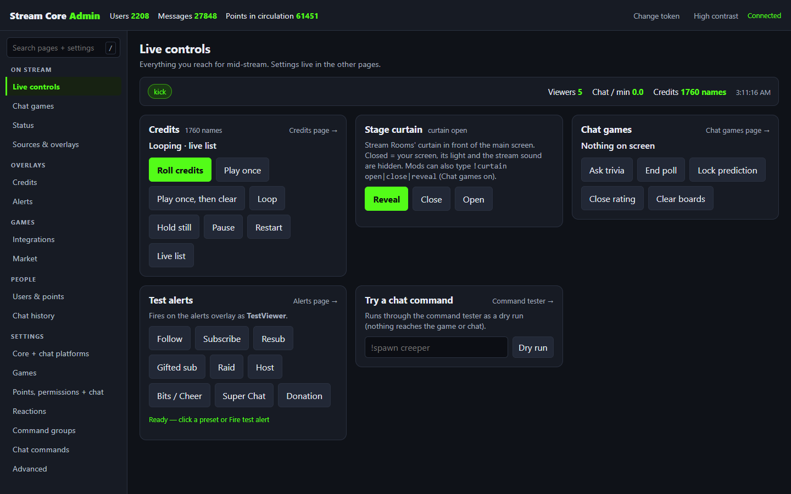

## Contents

**Part 1: Getting started**

- [1. What it is and what you need](#1-what-it-is-and-what-you-need)
- [2. Installing](#2-installing)
- [3. Starting and stopping](#3-starting-and-stopping)
- [4. The admin dashboard](#4-the-admin-dashboard)

**Part 2: Chat**

- [5. Connecting Kick, Twitch and YouTube](#5-connecting-kick-twitch-and-youtube)
- [6. Admins, mods and permissions](#6-admins-mods-and-permissions)
- [7. Chat points](#7-chat-points)
- [8. Chat history](#8-chat-history)
- [9. What Core adds to a message](#9-what-core-adds-to-a-message)

**Part 3: What chat can do**

- [10. Chat commands and command groups](#10-chat-commands-and-command-groups)
- [11. Chat reactions](#11-chat-reactions)
- [12. Chat games](#12-chat-games)
- [13. Alerts](#13-alerts)
- [14. End credits](#14-end-credits)
- [15. The Fridge Market](#15-the-fridge-market)

**Part 4: On screen**

- [16. Overlays in OBS and XSplit](#16-overlays-in-obs-and-xsplit)
- [17. Stream Rooms](#17-stream-rooms)

**Part 5: Games and companion apps**

- [18. Minecraft](#18-minecraft)
- [19. Factorio, Granvir and OpenTTD](#19-factorio-granvir-and-openttd)
- [20. Chat Credits and Reactive Image](#20-chat-credits-and-reactive-image)

**Part 6: Help**

- [21. Files and folders](#21-files-and-folders)
- [22. Safety](#22-safety)
- [23. Troubleshooting](#23-troubleshooting)
- [24. Quick reference](#24-quick-reference)

---

# Part 1: Getting started

## 1. What it is and what you need

Stream Core sits between your chat and everything that reacts to it:

```
Kick / Twitch / YouTube chat  →  Stream Core  →  overlays (OBS / XSplit)
                                             →  Stream Rooms (the 3D audience)
                                             →  games (Minecraft, Factorio, Granvir, OpenTTD)
```

It reads chat on all three platforms at once, treats every chatter the same way, and keeps one set of rules: who may use which command, how many points a message is worth, what a tomato costs, when a poll ends. Each thing that shows on stream (chat, alerts, credits, boards, reactions) is a small web page you add to OBS or XSplit as a browser source.

You need:

- **Windows** (it also runs on macOS and Linux from the command line).
- **Python 3.10 or newer** from [python.org](https://www.python.org/downloads/). Tick **Add python.exe to PATH** in its installer.
- A browser for the dashboard (any), and OBS or XSplit for the overlays.
- Your channel names. Twitch needs no login at all. Kick needs none either. YouTube needs the id of the live video (it changes every stream).

Stream Core only talks to your own PC: everything it serves is on `127.0.0.1` (port **3850**), so nothing is reachable from the internet.

## 2. Installing

1. Install Python (above).
2. Open the `fridge-stream-core` folder and double-click **install.bat**. It creates a private Python environment in `.venv`, installs the packages, and copies the example settings to `config\config.yaml` if you don't have one yet. Running it again later never wipes your settings.
3. When it asks, answer **Y** to run the setup wizard. The wizard asks for your Kick channel, your admin and mod names, an admin token for the dashboard (it makes one up if you leave it), and whether Minecraft should be on. Enter keeps the value shown in brackets. You can run it again any time with `.venv\Scripts\python.exe wizard.py`.

The monorepo also has **INSTALL Stream Core.bat** at its root, which does the same from one folder up.

Everything the wizard sets is also on the dashboard, so skipping it is fine.

## 3. Starting and stopping

Double-click **start.bat** (or **run.bat**, the same thing) whenever you stream. A black window opens and stays open; that window *is* Stream Core, so leave it alone while you stream. Closing it, or pressing **Ctrl+C** in it, stops Core.

The first lines it prints tell you what it connected to and, if you never set a token, the **admin token** it generated (also saved in `data\admin_token.txt`).

Start Core **before** Stream Rooms and before you open the overlays in OBS; they all connect to it and reconnect by themselves if it restarts.

Settings changes from the dashboard apply at once; only turning a game integration on or off needs a restart.

## 4. The admin dashboard

Open `http://127.0.0.1:3850/admin/` in your browser. The first time, paste your **admin token** into the box at the top and click **Save**. The browser remembers it. **Status loaded** or **Connected** at the top right means the page can talk to Core; a red line means the token is wrong.

The menu on the left is in five groups:

| Group | Pages |
|---|---|
| **On stream** | **Live controls** (everything for mid-stream), **Chat games**, **Status** |
| **Overlays** | **Sources & overlays** (the addresses for OBS), **Credits**, **Alerts** |
| **Games** | **Integrations** (command tester, Minecraft panel), **Market** |
| **People** | **Users & points**, **Chat history** |
| **Settings** | **Core + chat platforms**, **Games**, **Points, permissions + chat**, **Reactions**, **Command groups**, **Chat commands**, **Advanced** |

Things that help everywhere:

- **Search** (press `/`) finds pages and single settings and jumps to them.
- Every page has its own address (for example `/admin/#credits/style`), so the browser's Back button works and you can bookmark a page.
- A **Save changes** bar sits at the bottom of every settings page. It names what you changed and haven't saved, saves it all in one go, and answers **Ctrl+S**. Pages with unsaved edits get an orange dot in the menu. Leaving a page with unsaved edits asks first.
- Deleting a reaction, a command or a group, and **Reset form to defaults**, don't ask "are you sure": a message at the bottom offers **Undo** (or Ctrl+Z) for ten seconds instead. Things that act at once (live command test, merging users, clearing credits) still ask.
- **High contrast** (top right) switches to black and white with bigger outlines; it follows your system's "more contrast" setting until you pick.
- On a phone or tablet the menu becomes a drawer behind **☰**, so you can run the dashboard from beside the stream PC.


**Status** shows what's running: which chat platforms are connected, the command groups that are on, whether points and the chat log are on, and the game integrations. It refreshes itself every ten seconds.

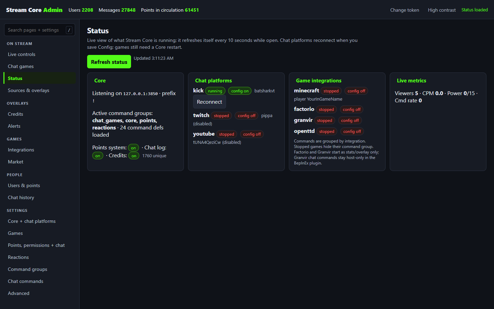

---

# Part 2: Chat

## 5. Connecting Kick, Twitch and YouTube

All three are off until you turn them on. Go to **Settings → Core + chat platforms**, fill in your channel, tick **Enabled** and press **Save & apply**. The platform connects straight away; no restart.

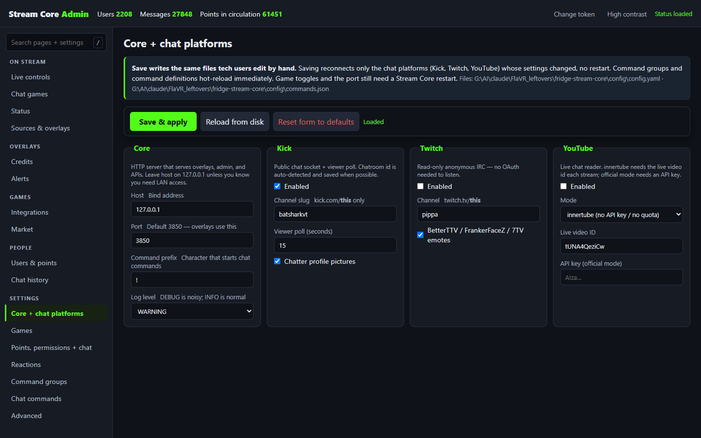

- **Kick**: your channel slug, the part after `kick.com/`. Core finds the chat room id by itself and remembers it. **Chatter profile pictures** looks each new chatter's picture up once (so their picture appears a moment after their first message) and keeps it. Kick also sends hosts, Kicks gifts and subs, which become alerts.
- **Twitch**: your channel name. Core listens anonymously, so there's no login and nothing to authorise. **BetterTTV / FrankerFaceZ / 7TV emotes** ride along with every message, so overlays and Stream Rooms show them. Cheers, raids and subs become alerts.
- **YouTube**: the live video's id (the `v=` part of its address), which changes every stream. Mode **innertube** needs no API key and has no quota, so leave it on that unless you need the official API's Super Chat details. Members and Super Chats become alerts.

Core can *read* all three, but it can't *post* into Kick or YouTube chat without a login. Its answers to commands ("you have 5 points") therefore show on the **replies overlay** and on Stream Rooms' reply screen, not in the platform's chat.

If you edit `config\config.yaml` by hand while Core runs, it notices and reconnects only the platforms whose settings changed (`core.watch_config` in that file turns this off).

## 6. Admins, mods and permissions

**Settings → Points, permissions + chat → Permissions** lists your **admins** and **mods**. Plain names match Kick and Twitch logins (case doesn't matter). YouTube names are display names anyone can copy, so a YouTube admin or mod needs the channel id, written as `youtube:UC…`; Core prints the id in its window the first time a YouTube chatter with that name talks.

What the roles mean: every command, reaction and game has a permission (**public**, **mod** or **admin**), and some can also ask for **sub** or **VIP**. Mods and admins pass every check. Admins also pay nothing for reactions unless you turn that off.

`!permit <name> [minutes]` (admins) lets one person use mod-only commands for a while.

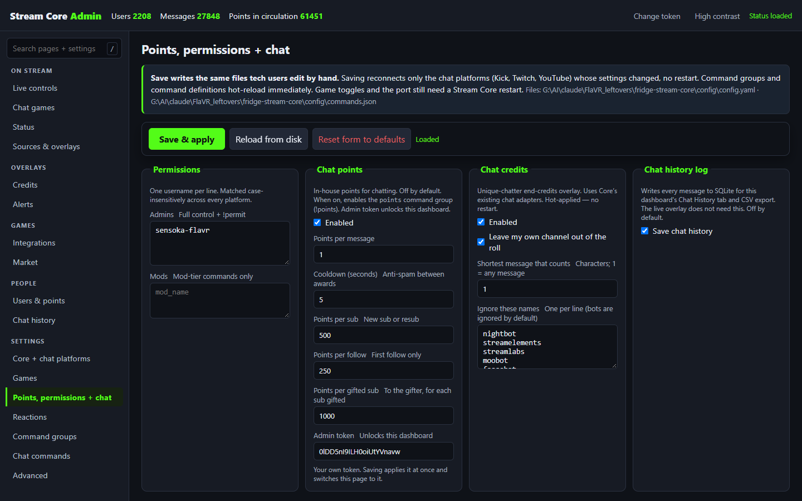

## 7. Chat points

Points are Core's own currency, kept in its database. Turn them on under **Settings → Points, permissions + chat → Chat points**:

- **Points per message** and a **cooldown** between awards per person, so spam earns nothing.
- Points for a **follow** (first follow only), a **sub or resub**, and for each **gifted sub** (to the gifter).

Chatters check theirs with `!points` (or `!balance`). Points pay for reactions that have a cost, for predictions, duels, slots and heists, for bumping a request and for a front-row seat.

**People → Users & points** lists everyone with their points and linked accounts. Click a person to give or take points, write a note, or link their Kick, Twitch and YouTube accounts so one person keeps one balance whichever platform they chat from. **Merge** joins two entries.

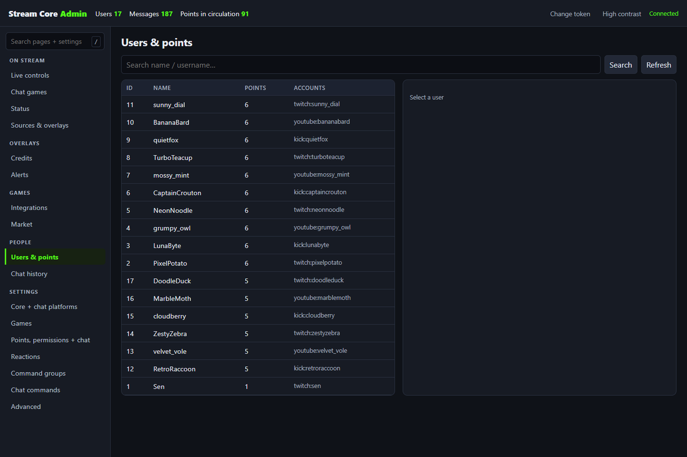

## 8. Chat history

Core shows chat live without keeping it. If you want a record, turn on **Chat history log** (same settings page). **People → Chat history** then shows every message with search, a platform filter and **Download CSV** (everything, or one person's messages from their user page).

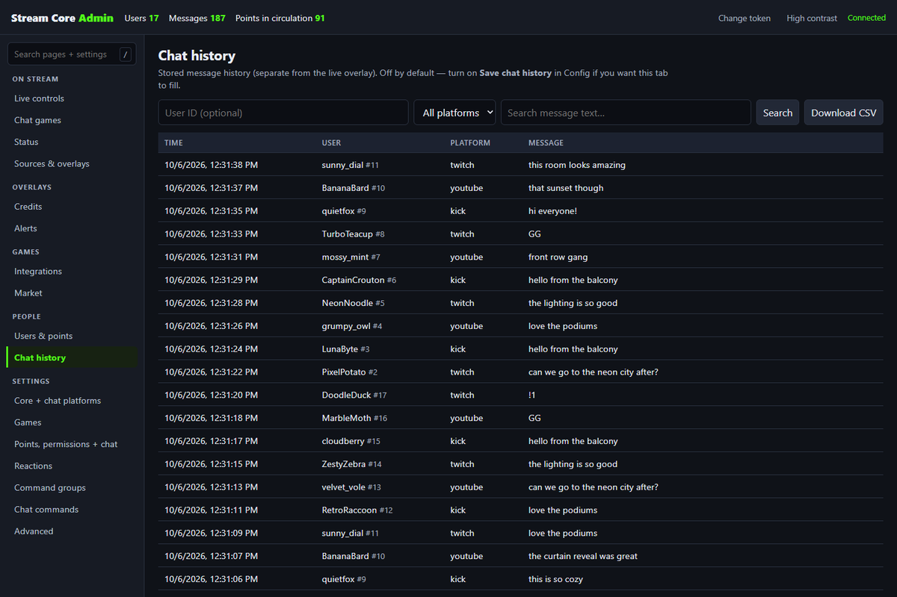

## 9. What Core adds to a message

Every message that reaches an overlay or Stream Rooms carries:

- the platform, the chatter's name, colour and badges (mod, sub, VIP) and their **profile picture** (YouTube sends it; Kick is looked up; Twitch has none yet);
- **emotes** as pictures: Twitch emotes plus BetterTTV, FrankerFaceZ and 7TV, Kick emotes, and YouTube's custom emoji;
- **who it replies to**: a message sent with Kick's or Twitch's reply button shows "↩ Replying to *Name*: what they said" on the chat overlay and in Stream Rooms. (On Twitch the "@Name" at the start of such a reply is left out, because the reply line already says who it's for. YouTube live chat has no reply button.)
- the chatter's **title** from chat games (*Regular*, *Die-hard*, *Legend*), once they have one.

---

# Part 3: What chat can do

## 10. Chat commands and command groups

Commands start with `!` (the prefix is a setting). `!help` lists the commands that are on right now, including the reaction and chat game commands.

**Settings → Command groups** turns whole sets on or off without a restart: *core* (`!help`, `!permit`, always on), *points*, *reactions*, *chat games*, *credits*, *market*, and one group per game (*minecraft*, *factorio*, *openttd*). A group tied to a feature is only on while that feature is on, so turning points off also silences `!points`.

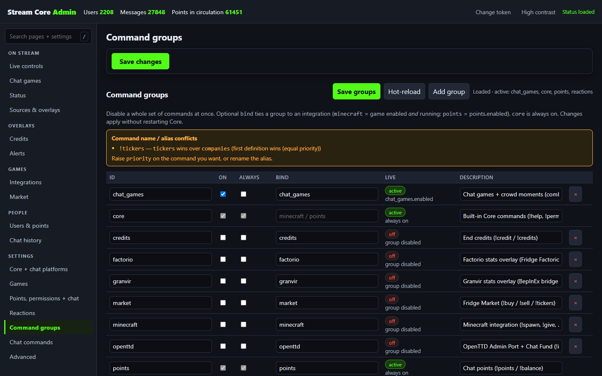

**Settings → Chat commands** lists every command with its group, permission, aliases and description; edit, add or delete them there. If two commands share a name, the higher **priority** wins and the page shows the clash. Changes apply at once. (Under the hood this is `config\commands.json`.)

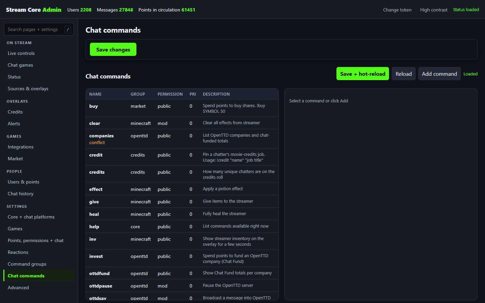

**Games → Integrations** has the **Command tester**: type a command, pick a platform and the roles to pretend, and **Dry run** (nothing happens, you just see what would) or **Live execute**. The Minecraft panel below it shows the player's health and lets you push metrics to the overlay. **Live controls** has a smaller dry-run box.

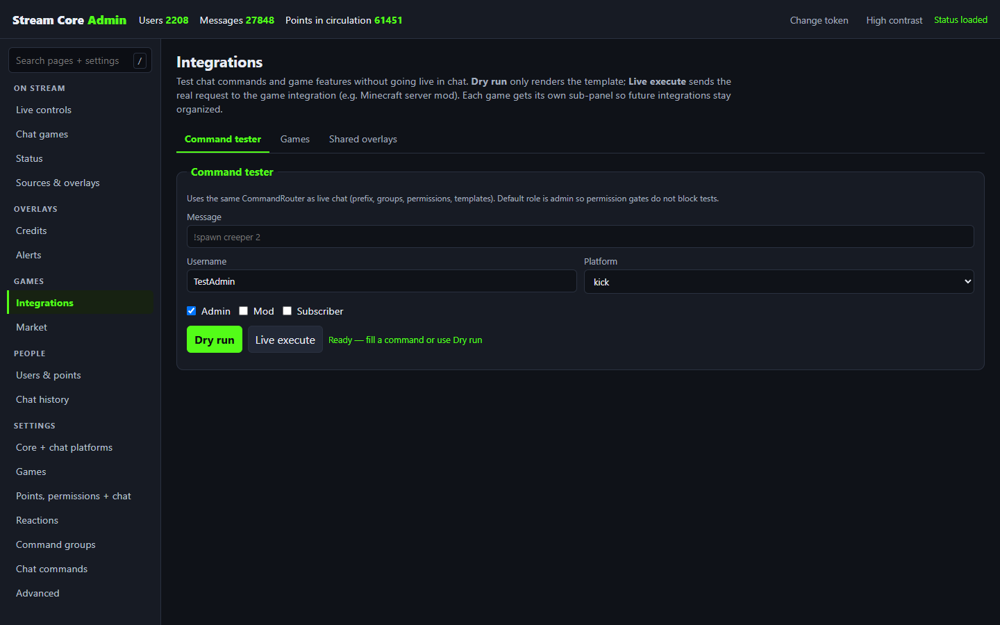

## 11. Chat reactions

A reaction is an emoji, an emote or a `!command` that plays an effect in Stream Rooms: tomatoes, roses, confetti, a boot, the lights flickering, a sign over someone's head. When Stream Rooms isn't running, a fallback overlay (`/overlay/reactions.html`) plays the simpler ones.

**Settings → Reactions** is where you decide what chat can throw and who may. Saving applies at once.

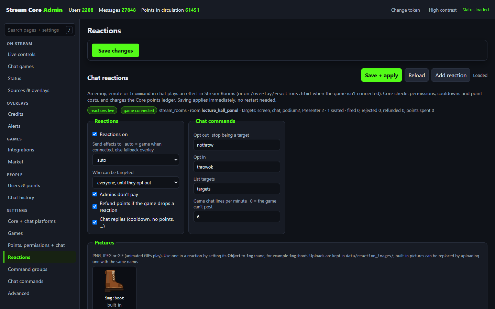

- **Reactions on**, and **Send effects to**: *auto* (Stream Rooms when it's connected, otherwise the fallback overlay), *game* or *overlay*.
- **Who can be targeted**: *everyone, until they opt out* (`!nothrow`), or only people who opted in (`!throwok`). `!targets` lists what can be aimed at in the current room.
- **Admins don't pay**, **Refund points if the game drops a reaction**, and **Chat replies** (answers about cooldowns and costs; emoji triggers never get a reply, so chat isn't spammed).
- Each reaction has its **triggers** (emoji, emote names, commands), an **effect** with its settings, **who** may use it (public, mod, admin; optionally subs or VIPs), **cooldowns** per person, for everyone and per target, a **point cost** (needs chat points on) and **how many** one message may fire.
- **Pictures**: upload PNG, JPEG or GIF files; a reaction whose object is `img:<name>` throws that picture.

How chat uses them:

| Typed in chat | What happens |
|---|---|
| `🍅` | Throw at the stage. `🍅🍅🍅` throws three (each one costs). |
| `🍅 @bob` or `!tomato @bob` | At that chatter's seat |
| `!tomato screen`, `!tomato presenter 2` | At a spot on the stage |
| `!tomato x5`, `!tomato @bob 5` | Five at once |
| `!sign GO TEAM` | A sign over your own head for 20 s |
| `!sleep` · `!snack` · `!phone` | 💤, 🍿 or a lit-up phone at your seat |
| `!highfive @name` | You both jump and high-five across the room |
| `!nothrow` / `!throwok` | Opt out of, or into, being a target |
| Kick emotes FLASHBANG, POLICE, ThisIsFine, DonoWall | A white flash, red and blue lights, fire on the stage, a big shout |

An emote name can be the thrown object: Core remembers every emote it has seen in chat, so `KEKW` flies as its picture.

## 12. Chat games

**On stream → Chat games**. Tick **Chat games on** on its **Settings** tab and press **Save + apply**. Games that spend points also need chat points on. Every game has its own **On** switch and its own command names.

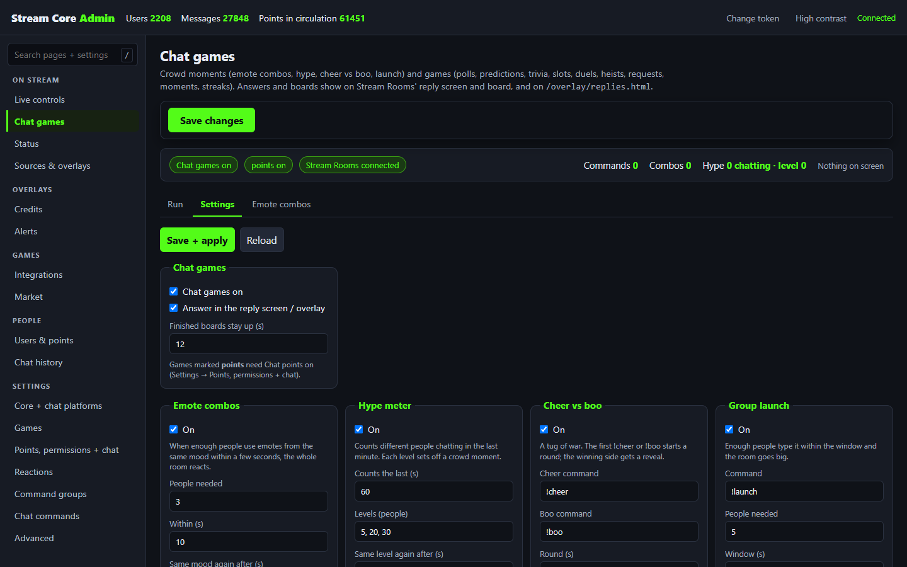

**Crowd moments** happen by themselves: when three or more people use emotes of the same mood (laugh, hype, clap, love, sad, dance, shock, sleepy, bye) within ten seconds, the room reacts; the **hype meter** counts how many different people are chatting and fires an effect at 5, 10 and 20; `!cheer` and `!boo` start a 30-second tug of war; five people typing `!launch` within a minute start a fireworks sequence.

**Games chat can play:**

| Chat | What happens |
|---|---|
| `!claim` | Free points once per stream |
| `!predict 1 50` / `!predict yes 50` | Bet on the open prediction; winners split the pot |
| `!duel @name 50` → `!accept` | Coin flip for both stakes; the loser gets a tomato |
| `!slots 20` | Three reels; about 93 % back on average |
| `!heist 50` → others `!join 50` | A crew; the story plays out on the reply screen |
| `!1` `!2` `!3` | Vote in the open poll |
| `!rate 8` | Rate what's on, 1 to 10; the result goes into the end credits |
| `!request <link or title>`, `!bump`, `!queue` | A request queue; bumping costs points |
| `!clip` / `!moment [note]` | Marks the stream time |
| `!answer <guess>` | Answers the trivia question; first right answer wins points and a spotlight |
| `!seat front` / `!seat back`, `!swap @name` | Move seats in Stream Rooms; the front row costs points |
| `!streak` | Streams in a row, best run and total; titles at 5 / 10 / 25 streams |

Amounts can be `50`, `1k` or `all`.

**Mods start things** from chat (`!poll Question? | A | B | C`, `!predict open …`, `!predict win A`, `!trivia`, `!rate open Title`, `!curtain open` / `close` / `reveal`) or from the dashboard's **Run** tab, which also has the request queue, the moments list with a CSV download, **Start a new stream now** and a **Test chat** box that sends a line through the whole live path.

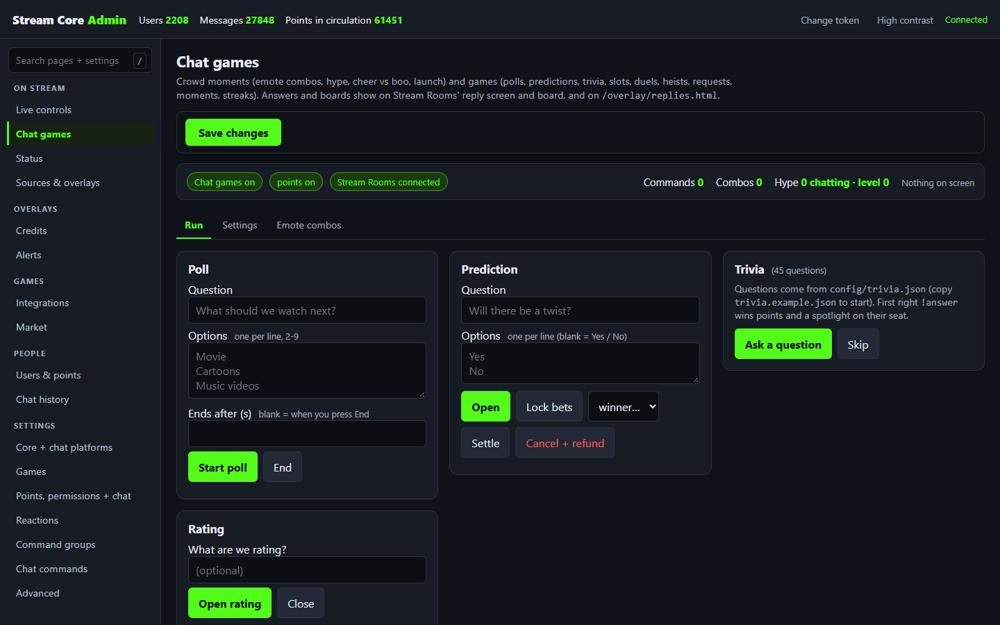

Boards (polls, predictions, the hype meter, heist crews, trivia) show on the **replies overlay**, on Stream Rooms' reply screen, and in its top-right corner in rooms without one. Trivia questions come from `config\trivia.json` (45 general-knowledge questions ship as `trivia.example.json`); the **Ask one every** setting asks on a timer.

## 13. Alerts

Alerts fire from real events as they happen: follows, subs, resubs and gifted subs (Twitch, YouTube memberships, Kick subs), raids and hosts, Twitch cheers, Kick Kicks gifts, YouTube Super Chats. Points can be awarded for them (section 7).

**Overlays → Alerts** is the test bench: fire any kind as **TestViewer** without a live event, pick a **skin** (**Classic**, **Card**, or **Custom CSS only**) and paste **Custom CSS**. How long an alert stays is `overlay.alert_duration_ms` in `config.yaml` (six seconds by default). The overlay uses the same ids and classes as Streamlabs and StreamElements alert boxes, so CSS you wrote or bought for those works here with little or no change. **Live controls** has the same test buttons.

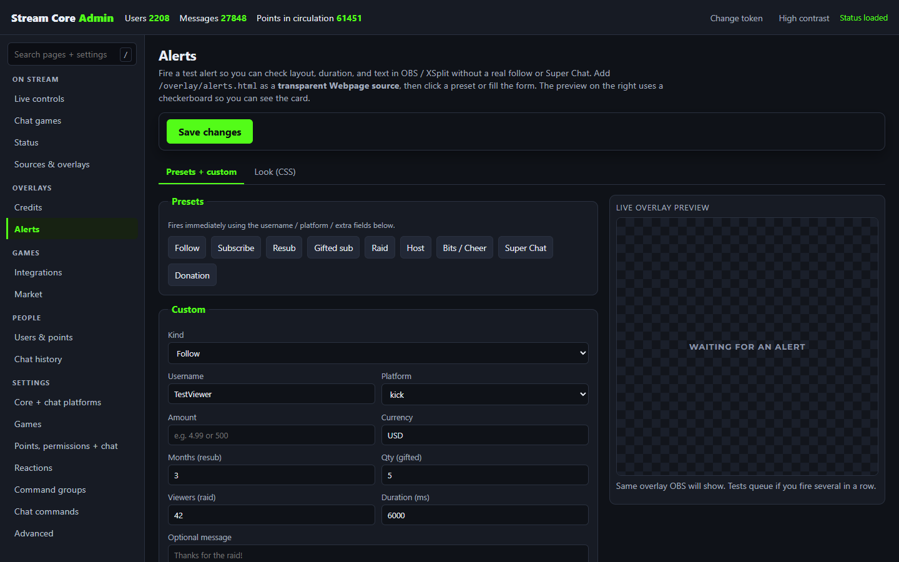

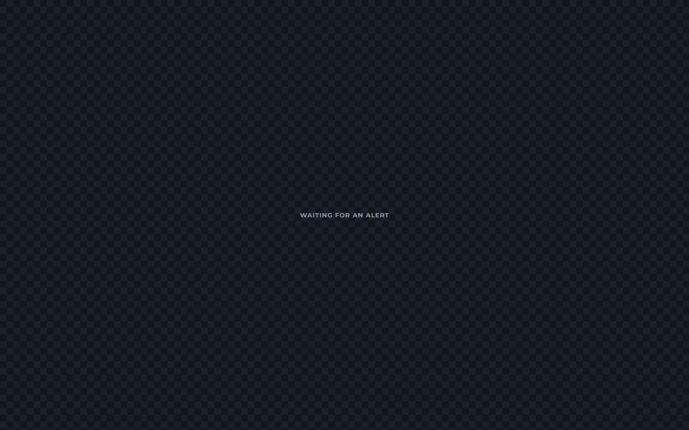

Pictures: drop a file named after the kind into `overlay\assets\alerts\` (`follow.gif`, `subscribe.png`, `raid.webm`, `superchat.webp`, …). WebM is picked first, then GIF, WebP, PNG or SVG. With none, a glowing tile shows.

## 14. End credits

A rolling list of everyone who chatted this stream. **Overlays → Credits**:

- **Feature + roll**: turn it on, then **Roll credits (freeze list)** to lock the list and loop it, **Live list** to let newcomers join the roll, **Play once** (or **Play once, then clear**, which leaves the screen empty afterwards), **Hold still**, **Pause**, **Restart**, and **Download CSV**. The list under the preview updates live and shows mods (★), message counts and sub / VIP / paid.
- **Style**: nine **motions** (Classic crawl, crawl down, Star Wars, cards, fade, slides, a name tape, Teletype, Matrix), presets along the top, and tabs for the copy (title, subtitle, footer), type, colours, layout and list order. Edits preview live; **Save look** keeps them.
- **Settings → Points, permissions + chat → Chat credits** has the roster filters: leave your own channel out, the shortest message that counts, and names to ignore (the built-in bot list applies when it's empty).

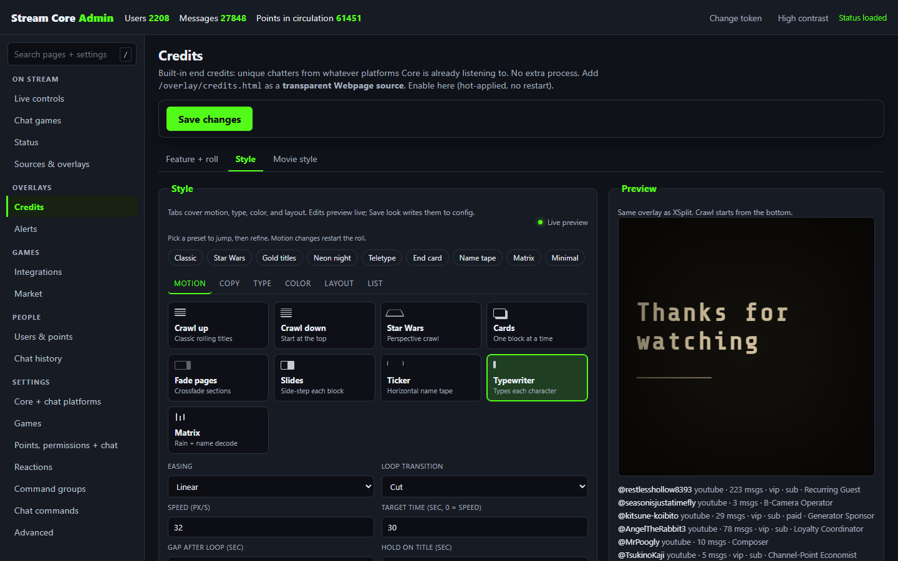

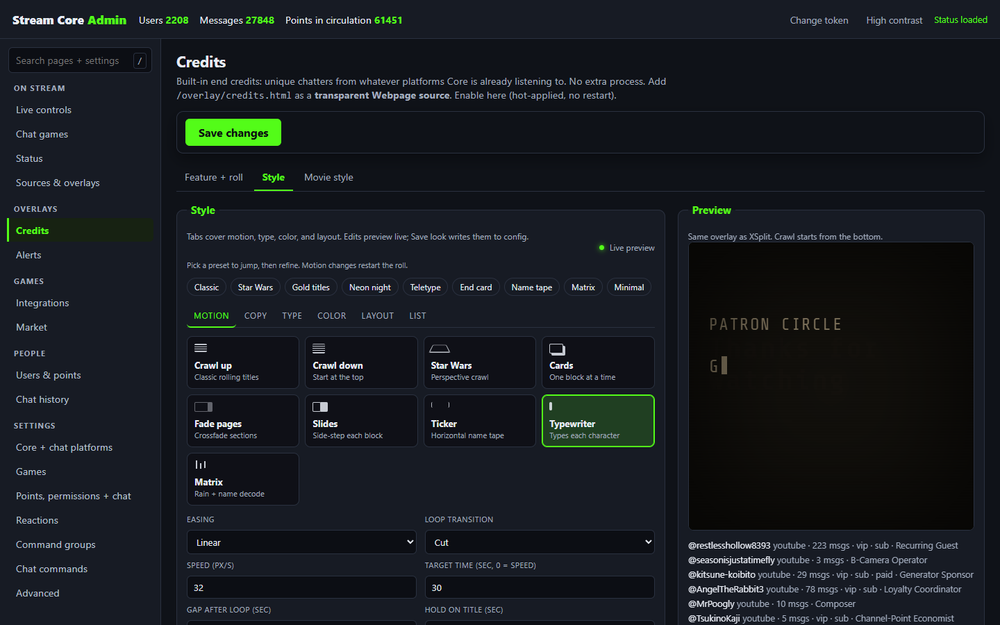

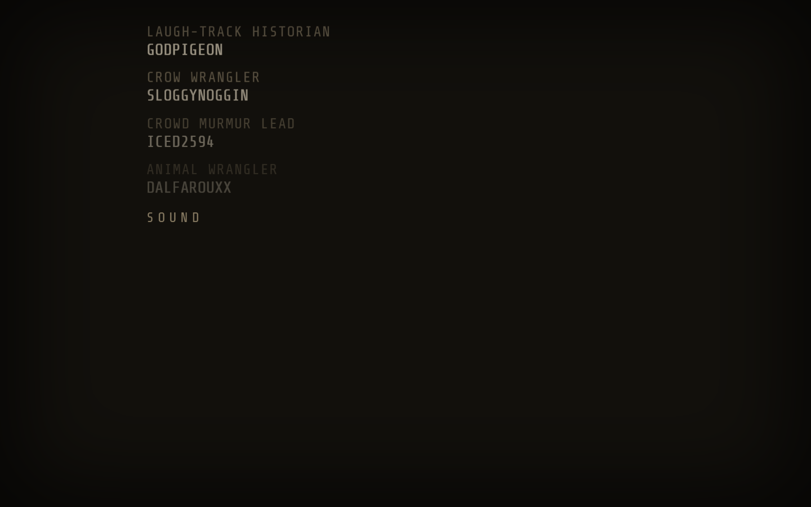

The latest `!rate` result of the stream appears in the credits above the footer, and regulars' titles next to their names. A movie-style cast list (departments, "Starring", a rating card, a stinger) can be written as a JSON file under `config\cast\` and picked under Layout → **Cast format**.

## 15. The Fridge Market

A points stock market that keeps the stream tape alive: tickers for the games you play (and for you, the streamer), prices that move with the game and with how many people play it on Steam, dividends paid from in-game vaults, and overlays that show it all.

**Games → Market**:

- **Listings**: the tickers, each with a name, which book it belongs to (core or a game), an optional Steam App ID (then **CCU**, the number of people playing it right now, moves the price), the price and whether it shows on the tape. Add one with a symbol and a name.
- **Minecraft** and **Factorio**: which tickers each game's events read or pay, and the vault settings (what the Dividend Dynamo and the Smelt Chest, or the Factorio power and item vaults, are worth in points).
- **Investors**: grant shares to someone by hand, an hourly cap on payouts, and how often Steam numbers refresh.
- **Tape preview**: what the ticker overlay shows.

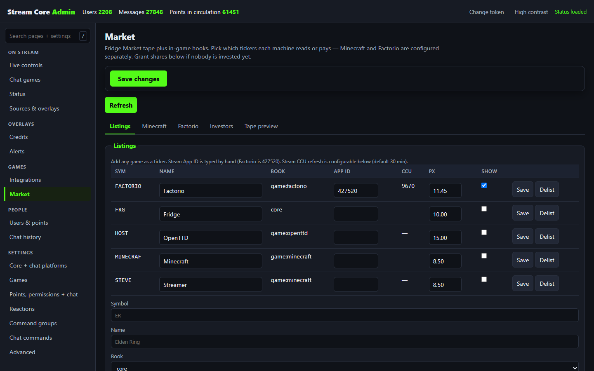

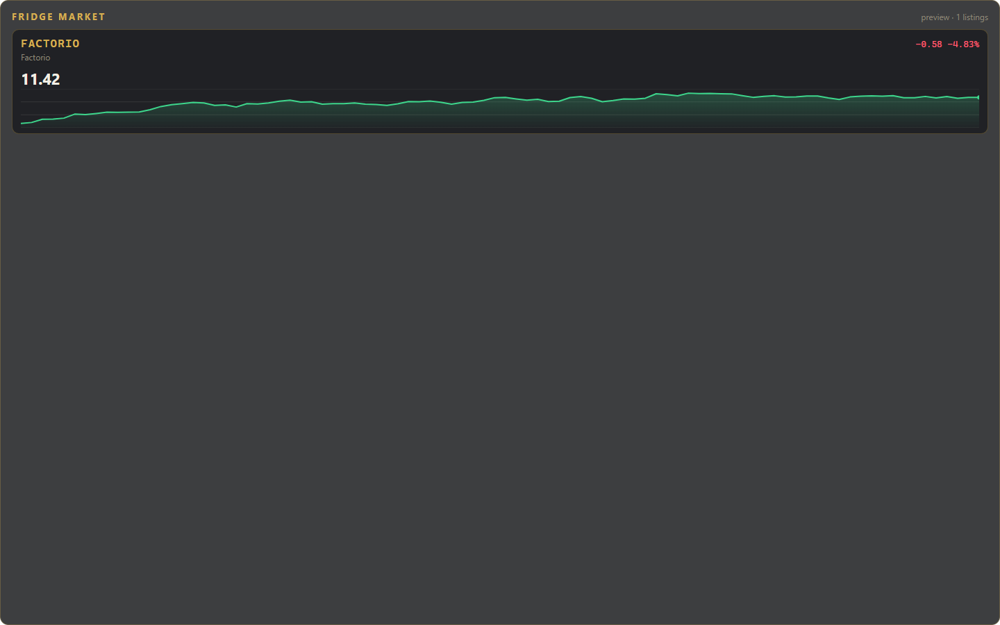

Viewer trading (`!buy`, `!sell`, `!tickers`) is designed but not switched on yet; what ships today is the tape, the game vaults and the overlays. The design is in `docs\MARKET.md`.

---

# Part 4: On screen

## 16. Overlays in OBS and XSplit

Each overlay is a web page. Add it as a **Browser source** (OBS) or **Webpage source** (XSplit) with a transparent background, one source per overlay, so you can place and size each on its own. **On stream → Sources & overlays** lists every address with a **Copy** button.

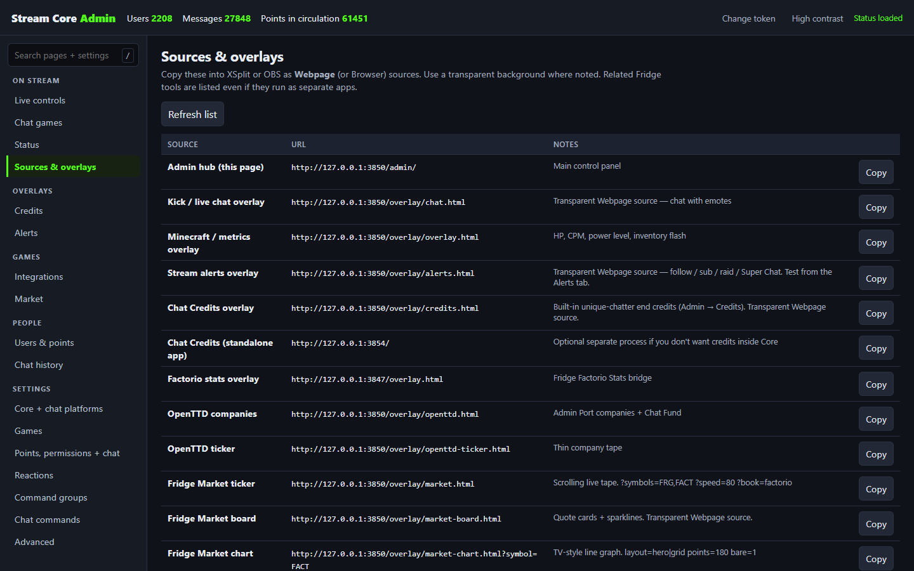

| Overlay | Address | Notes |
|---|---|---|
| Chat, all platforms | `http://127.0.0.1:3850/overlay/chat.html` | `?platform=twitch` (or `kick`, `youtube`) for one platform; `?platforms=kick,twitch` for a set; `&badges=0` hides the K / T / Y letters |
| Alerts | `http://127.0.0.1:3850/overlay/alerts.html` | `?skin=classic` / `card` / `custom`; `?preview=1` shows a sample |
| End credits | `http://127.0.0.1:3850/overlay/credits.html` | `?motion=matrix&title=THE%20CREW` overrides the saved look |
| Replies and chat games boards | `http://127.0.0.1:3850/overlay/replies.html` | `?boards=0` hides boards, `?replies=0` shows boards only |
| Reactions fallback | `http://127.0.0.1:3850/overlay/reactions.html` | Only needed when Stream Rooms isn't running |
| Market ticker / board / chart | `…/overlay/market.html`, `market-board.html`, `market-chart.html?symbol=FACT`, `market-cycle.html?symbols=FRG,FACT` | |
| Minecraft stats | `http://127.0.0.1:3850/overlay/overlay.html` | Health, food, XP, deaths, armour, viewers, chat per minute, power, inventory; `?show=` / `?hide=` pick widgets |
| OpenTTD companies / ticker | `…/overlay/openttd.html`, `openttd-ticker.html` | |


Twitch asks for its chat to be kept apart from other platforms' chat; one chat overlay per platform does that.

## 17. Stream Rooms

Stream Rooms connects to Core on its own (**Chat tab → Connect**, address `ws://127.0.0.1:3850/ws`). From then on:

- every chat message seats its chatter in the 3D audience and shows as a speech bubble, with pictures, emotes, reply lines and titles;
- Core's answers and the chat games boards show on the room's reply screen (or its corner);
- reactions play in the room: tomatoes land on seats, signs go up, lights flicker, the crowd dances;
- `!curtain open` / `close` / `reveal` (mods) and the **Stage curtain** buttons on **Live controls** run the room's curtain;
- `!seat` and `!swap` move people.

Stream Rooms tells Core which effects the current room can play, so reactions never ask for something the room can't do. The full picture of the room side is in the Stream Rooms manual.

---

# Part 5: Games and companion apps

## 18. Minecraft

Two Fabric mods (in the `fridge-minecraft` folder) let chat reach into the game: the **client mod** reports the player's stats for the overlay (port 3852) and the **server mod** runs commands and the Chat Dynamo (port 3853). Install the pre-built jars, start the game, then turn **Minecraft** on under **Settings → Games** with your in-game name and restart Core. Commands such as `!spawn creeper` or `!give` are in the *minecraft* command group; the Minecraft panel on **Games → Integrations** shows health and lets you push metrics. The **Market** page's Minecraft tab wires the Dividend Dynamo and the Smelt Chest to tickers.

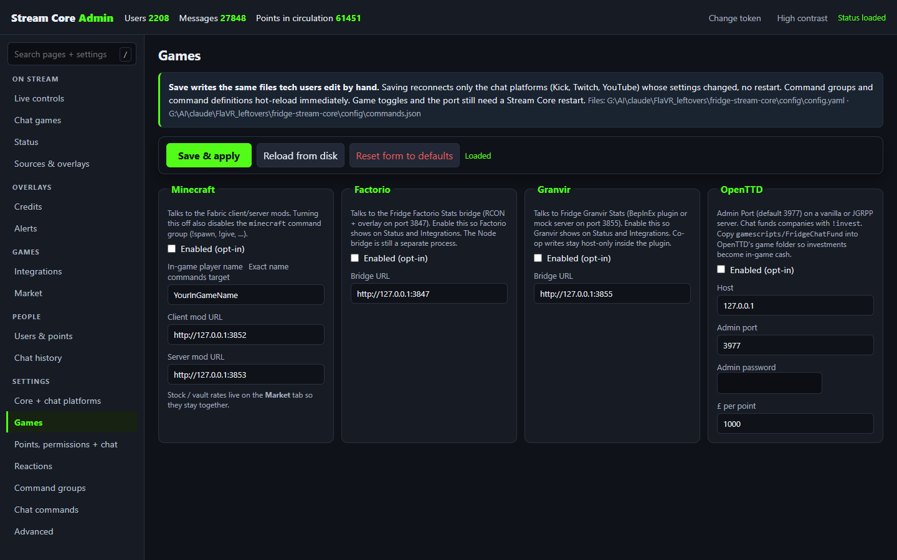

## 19. Factorio, Granvir and OpenTTD

- **Factorio**: run the **Fridge Factorio Stats** bridge (port 3847) next to the game; it reads power, research and kills over RCON and feeds overlays of its own. In Core, turn **Factorio** on under **Settings → Games**. The power and item vaults pay market dividends.
- **Granvir**: the **Fridge Granvir Stats** plugin (BepInEx, port 3855) reports co-op stats; turn **Granvir** on the same way.
- **OpenTTD**: Core joins the game's admin port and runs the **Chat Fund**: `!invest` turns points into company cash, `!companies` lists them, and two overlays show the companies and a ticker. Settings are on the Games page (host, admin port and password, points-to-pounds rate, limits).

Game toggles need a Core restart; everything else applies live.

## 20. Chat Credits and Reactive Image

- **Fridge Chat Credits** is the standalone, lighter version of the credits roll: it listens to the platforms itself and drives the same overlay without the rest of Core. Use it when you don't need Core at all. Its look keys are the same as Core's credits, so a saved style moves between the two.
- **Reactive Image** is a small native Windows app for an audio-reactive PNG avatar (idle, soft, speak, loud, plus custom states on hotkeys or from a tablet). Capture its window in OBS or XSplit. It doesn't talk to Core.

---

# Part 6: Help

## 21. Files and folders

| Where | What |
|---|---|
| `config\config.yaml` | All settings. The dashboard writes it; you can edit it by hand too (Core notices). Your tokens and keys live here and nowhere else. |
| `config\commands.json` | The chat commands (Settings → Chat commands). |
| `config\trivia.json` | Your trivia questions (`trivia.example.json` is the sample). |
| `config\cast\*.json` | Movie-style credits layouts. |
| `data\stream_core.db` | Points, users, linked accounts, the chat log, stream attendance. Back this folder up if you care about points. |
| `data\admin_token.txt` | The generated admin token, when you didn't set one. |
| `data\kick_avatars.json`, `chat_games.json`, `reactions_optout.json` | Caches and small state files. |
| `overlay\assets\alerts\` | Your alert pictures and videos. |
| `.venv\` | Core's private Python. Delete it and run install again if Python ever gets confused. |

## 22. Safety

- Core listens on **127.0.0.1** only and refuses requests that come from other web sites or that name another host, so a page you visit can't talk to it. Only turn that off (**Settings → Advanced**) if you serve it on your LAN on purpose.
- The **admin token** is the dashboard's password. Change it under **Settings → Points, permissions + chat → Admin token**; the dashboard switches to the new one as you save.
- Nothing posts into your chat: Core only reads. Alerts, replies and boards are overlays on your own stream.
- Game bridges (the Minecraft mods, the Factorio bridge) only accept calls from Core.

## 23. Troubleshooting

| Problem | Try this |
|---|---|
| The dashboard says the token is wrong | Paste the token from `data\admin_token.txt` (or `points.admin_token` in `config.yaml`) and click **Save**. |
| Nothing arrives from a platform | **Status**: is it connected? Settings → Core + chat platforms: is it **Enabled**, is the channel right? YouTube: the video id is new every stream. |
| Kick can't find the chat room | Open `https://kick.com/api/v2/channels/<your slug>` in a browser, find `"chatroom": {"id": …}` and put that number in `kick.chatroom_id` (Settings → Advanced). |
| A chat command does nothing | Settings → Command groups: is its group on? Settings → Chat commands: its permission and whether another command owns the name. Try it in the **Command tester**. |
| `!points` says points are off | Settings → Points, permissions + chat → **Chat points** on. |
| Tomatoes don't fly | Settings → Reactions → **Reactions on**; the reaction's permission, cooldown and cost; Stream Rooms' Games tab → **Play reactions**; without Stream Rooms, add the reactions overlay. |
| Alerts don't show | Add `/overlay/alerts.html` as a browser source; test from **Live controls**. Follows and subs need the platform connected. |
| Credits are empty | Overlays → Credits → turn it on; the list fills as people chat. Check the roster filters under Settings → Points, permissions + chat → Chat credits. |
| The game toggle didn't take | Minecraft, Factorio, Granvir and OpenTTD switches need a Core restart. |
| Stream Rooms says it isn't connected | Start Core first; in Stream Rooms' Chat tab check **Core address** is `ws://127.0.0.1:3850/ws` and click **Retry now**. |
| The window closed with an error | Run **start.bat** again and read the last lines. Running **install.bat** again repairs the packages without touching your settings. |

## 24. Quick reference

- **Ports**: Core 3850 (dashboard, overlays, Stream Rooms); Minecraft mods 3852 and 3853; Factorio bridge 3847; Granvir 3855.
- **Go-live checklist**: start Core (start.bat), start Stream Rooms, open OBS with the overlays, check **Status**, keep **Live controls** open.
- **Mid-stream**: **Live controls** for the curtain, test alerts, chat games and credits; the **Run** tab of Chat games for polls, trivia and the request queue.
- **Ending**: **Live controls → Roll credits** (or Play once), then close the curtain.
- **Viewer commands**: `!help`, `!points`, `!claim`, `!predict`, `!duel`, `!slots`, `!heist`, `!1`/`!2`/`!3`, `!rate`, `!request`, `!queue`, `!clip`, `!answer`, `!seat`, `!swap`, `!streak`, `!tomato`, `!sign`, `!highfive`, `!nothrow` / `!throwok`.
- **Mod commands**: `!poll`, `!predict open` / `lock` / `win` / `cancel`, `!trivia`, `!rate open` / `close`, `!curtain`, `!permit`.
